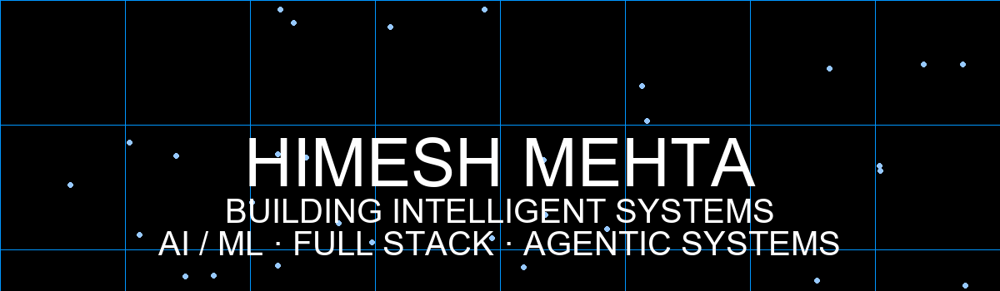

  

 

  <strong>Computer Science Student · AI/ML · Full Stack Developer</strong> 
  <em>Building intelligent AI-powered applications, developer tools, and scalable products.</em>

  
  
  

---

### 🔭 Currently Working On
- 🤖 **AI Agents & LLM Architectures** (Multi-agent workflows, autonomous systems)
- 🛰️ **Geospatial & Earth Observation AI** (Satellite data processing, vision models)
- ⚡ **Modern Full-Stack Applications** (Next.js, FastAPI, Cloud Native)

---

### 🚀 Featured Projects

| Project | Description | Tech Stack |
| :--- | :--- | :--- |
| 🧠 **JARVIS AI** | Multimodal intelligent AI assistant | `Python` `LLMs` `RAG` `Agents` |
| 🛰️ **TerraChange** | AI-powered Earth observation and satellite analytics platform | `Geospatial AI` `FastAPI` `React` |
| 📈 **TradePro** | High-performance modern trading analytics & insight platform | `Next.js` `TypeScript` `PostgreSQL` |

---

### 🛠️ Tech Stack

  

---

  <em>Open to collaborations and building impactful AI systems. Feel free to connect!</em>

